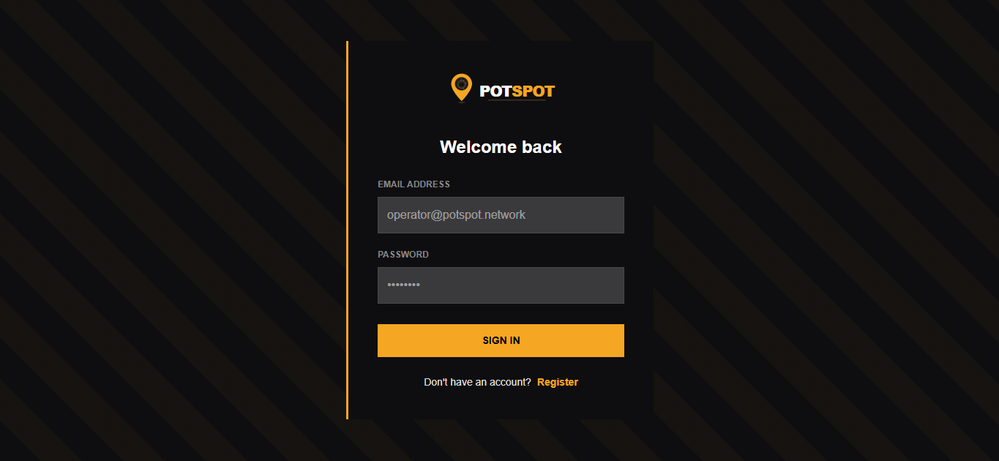
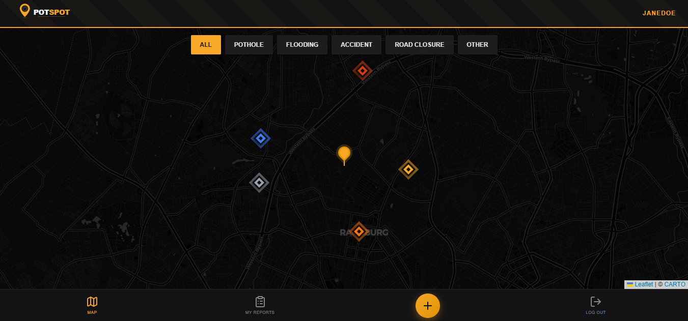
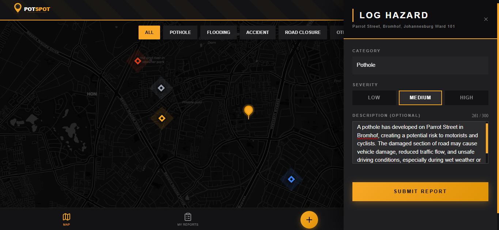
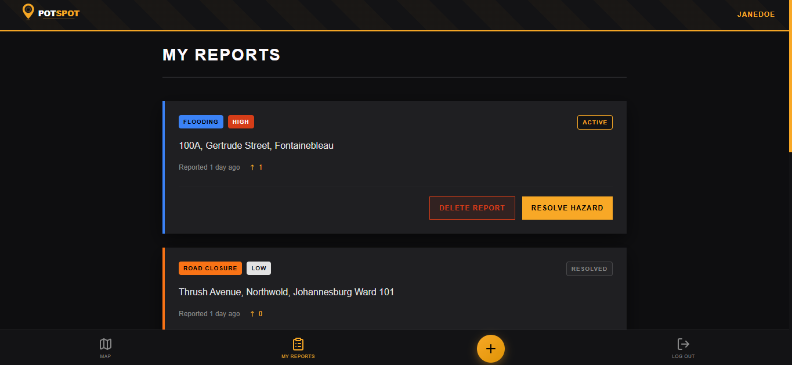
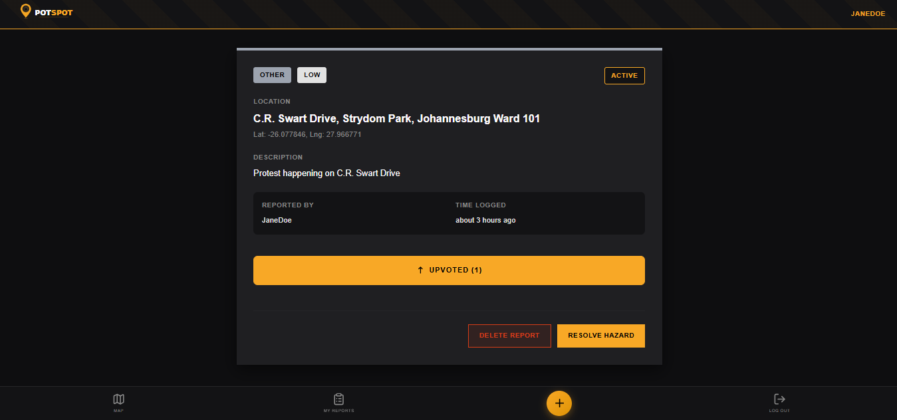
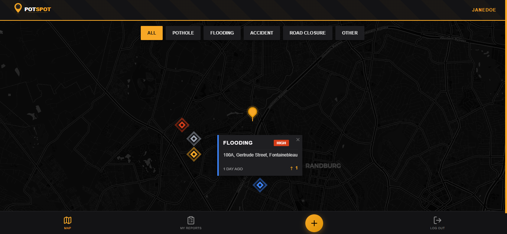

<div align="center">


# PotSpot

**Community-powered road hazard intelligence for South Africa.**

Report potholes, flooding, accidents, and road closures in seconds. Watch them appear on a live map for everyone around you — no refresh needed.

[](https://potspot.vercel.app)
[]()
[](https://nodejs.org)
[](https://react.dev)
[](https://www.mongodb.com/atlas)

</div>

---

## The Problem

South Africa loses billions of rands each year to road infrastructure damage. Drivers encounter potholes, flash floods, and unannounced road closures daily — with no reliable, real-time way to know what is ahead or to report what they have seen.

Municipal reporting systems are slow, inaccessible, and opaque. By the time a pothole is logged and actioned, hundreds of vehicles have already damaged their tyres on it.

## The Solution

PotSpot is a real-time civic mapping platform where communities self-organise around road safety. Anyone can report a hazard in under 10 seconds. The report appears instantly on a live map for every connected user in the area — no page refresh, no delay.

Reports are crowdsource-verified through upvotes, automatically expire after 48 hours to keep the map accurate, and include reverse-geocoded street addresses so reports are immediately human-readable.

Think Waze, built for the specific road conditions and infrastructure challenges of South African cities.

---

## Screenshots

| Login | Map View | Report a Hazard |
|-------|----------|-----------------|
|  |  |  |

| My Reports | Report Detail | Map with Pins |
|------------|---------------|---------------|
|  |  |  |

---

## Key Features

**Real-time map updates**
Reports submitted by any user appear on every connected device within milliseconds via WebSockets. No polling, no refresh.

**One-tap hazard reporting**
The crosshair tracks the map centre. Pan to the exact location, select a category and severity, and submit. The report is pinned at that precise coordinate.

**Automatic address resolution**
Every report is reverse-geocoded against the OpenStreetMap Nominatim API. Coordinates become readable street addresses automatically.

**Community verification**
Users upvote reports they have personally encountered. Higher upvote counts surface the most critical hazards.

**Smart auto-expiry**
Reports expire automatically after 48 hours via MongoDB TTL indexes. The map stays accurate without any manual moderation.

**Category filtering**
Filter live map pins by pothole, flooding, accident, road closure, or other. The map updates instantly client-side with no additional API calls.

**Full report lifecycle**
Report owners can mark hazards as resolved when fixed, or delete them entirely. Resolved reports remain visible in the dashboard for reference.

**Responsive across devices**
The bottom navigation bar, horizontally scrollable filter pills, and slide-in report panel are all designed for mobile-first use.

---

## Why This Matters

South Africa's road infrastructure crisis disproportionately affects lower-income commuters who rely on public transport routes that are often the worst maintained. A community-driven reporting tool lowers the barrier to civic participation — no phone call to a municipality, no form to fill in, no account verification required beyond registration.

PotSpot is designed to scale. The same architecture that serves Johannesburg can serve Durban, Cape Town, or any city where communities want better visibility into the roads they use every day.

---

## Architecture

```
+-------------------------------------------------------------+
|                      Client (React)                         |
|  react-leaflet  *  Socket.io-client  *  Axios  *  Vite     |
+---------------------------+---------------------------------+
                            | HTTPS + WSS
+---------------------------+----------------------------------+
|                   Server (Express)                          |
|   JWT Auth  *  Socket.io  *  Rate Limiting  *  Helmet      |
+----------+----------------------------------+---------------+
           |                                  |
+----------+-----------+    +-----------------+-------------+
|   MongoDB Atlas      |    |  OpenStreetMap Nominatim     |
|  Reports + Users     |    |  Reverse Geocoding API       |
+----------------------+    +------------------------------+
```

**Real-time flow:**
1. User submits a report via the frontend
2. Express validates, geocodes, and saves to MongoDB
3. Socket.io emits `new_report` to all connected clients
4. Every open map updates instantly with the new pin

---

## Tech Stack

**Frontend**

| Technology | Purpose |
|---|---|
| React 18 + Vite | UI framework and build tooling |
| react-leaflet | Interactive map rendering |
| Socket.io-client | Real-time WebSocket connection |
| Axios | HTTP client with JWT interceptors |
| shadcn/ui | Base component primitives |
| date-fns | Relative time formatting |
| lucide-react | Icon system |

**Backend**

| Technology | Purpose |
|---|---|
| Node.js + Express | API server |
| Socket.io | WebSocket server for real-time events |
| Mongoose | MongoDB ODM |
| bcrypt | Password hashing |
| jsonwebtoken | Stateless JWT authentication |
| helmet | Secure HTTP headers |
| express-rate-limit | Request rate limiting |

**Infrastructure**

| Service | Role |
|---|---|
| MongoDB Atlas | Database (Cape Town, af-south-1) |
| Render | Backend hosting |
| Vercel | Frontend hosting and CDN |
| OpenStreetMap Nominatim | Reverse geocoding |

---

## Security

PotSpot is built with defence-in-depth across every layer:

- JWT authentication on all report routes with ownership checks preventing IDOR attacks
- Manual NoSQL injection sanitisation stripping `$` and `.` keys from all request bodies
- `helmet` setting secure HTTP headers including XSS protection and content-type sniffing prevention
- `express-rate-limit` with separate limits for general routes (100 req/15min) and auth routes (5 req/15min)
- CORS restricted to the exact frontend URL with no wildcard origins
- Server refuses to start if any critical environment variable (`MONGO_URI`, `JWT_SECRET`, `FRONTEND_URL`) is missing
- Input validation at controller level: coordinate range checks, enum guards, ObjectId validation, and description length limits

---

## Getting Started

### Prerequisites

- Node.js 18 or higher
- A MongoDB Atlas account (the free M0 tier is sufficient)
- Git

### Installation

```bash
git clone https://github.com/darrylchikamba/potspot.git
cd potspot
```

**Backend**

```bash
cd server
npm install
```

Create `server/.env`:

```env
PORT=5000
MONGO_URI=mongodb+srv://<user>:<password>@<cluster>.mongodb.net/potspot
JWT_SECRET=your_strong_random_secret_here
FRONTEND_URL=http://localhost:5173
```

```bash
npm run dev
```

The server starts on `http://localhost:5000`. You should see:

```
Server listening on port 5000
MongoDB Connected: <your-cluster-host>
```

**Frontend**

Open a second terminal:

```bash
cd client
npm install
```

Create `client/.env`:

```env
VITE_API_URL=http://localhost:5000
```

```bash
npm run dev
```

Open `http://localhost:5173` in your browser.

---

## API Reference

All report endpoints require a valid JWT in the `Authorization: Bearer <token>` header.

### Authentication

| Method | Endpoint | Body | Description |
|--------|----------|------|-------------|
| `POST` | `/api/auth/register` | `{ username, email, password }` | Create account |
| `POST` | `/api/auth/login` | `{ email, password }` | Authenticate and receive JWT |

### Reports

| Method | Endpoint | Access | Description |
|--------|----------|--------|-------------|
| `GET` | `/api/reports` | Protected | Fetch all reports |
| `GET` | `/api/reports/:id` | Protected | Fetch single report |
| `POST` | `/api/reports` | Protected | Submit new hazard report |
| `PUT` | `/api/reports/:id/upvote` | Protected | Toggle upvote |
| `PUT` | `/api/reports/:id/resolve` | Owner only | Mark as resolved |
| `DELETE` | `/api/reports/:id` | Owner only | Delete report |

### Report Schema

```json
{
  "location": {
    "type": "Point",
    "coordinates": [longitude, latitude]
  },
  "category": "pothole | flooding | accident | road_closure | other",
  "severity": "low | medium | high",
  "description": "Optional, max 300 characters",
  "address": "Auto-populated via reverse geocoding"
}
```

### WebSocket Events

| Event | Direction | Payload | Description |
|-------|-----------|---------|-------------|
| `new_report` | Server to Client | Full report object | Broadcast when any report is created |
| `upvote_updated` | Server to Client | `{ reportId, upvotes }` | Broadcast when upvote count changes |

---

## Deployment

PotSpot uses a split deployment: Render for the backend and Vercel for the frontend.

### Backend (Render)

1. Create a new **Web Service** on [render.com](https://render.com)
2. Connect your GitHub repository
3. Set the following:
   - **Build command:** `cd server && npm install`
   - **Start command:** `cd server && node index.js`
4. Add environment variables in the Render dashboard:
   - `MONGO_URI` — your MongoDB Atlas connection string
   - `JWT_SECRET` — a strong random string (32+ characters recommended)
   - `FRONTEND_URL` — your Vercel URL (add this after deploying the frontend)
   - `PORT` — `5000`
5. Deploy and copy the service URL

### Frontend (Vercel)

1. Import your repository on [vercel.com](https://vercel.com)
2. Leave the root directory blank
3. Add environment variable:
   - `VITE_API_URL` — your Render service URL
4. Deploy

The `vercel.json` in the root handles SPA routing so all React Router paths resolve correctly.

### Final step

Return to Render and update `FRONTEND_URL` to your Vercel deployment URL, then trigger a redeploy.

---

## Roadmap

The current release covers core hazard reporting. These are the features being considered for future development:

- **Municipality API integration** — push verified reports directly to local government maintenance systems
- **Push notifications** — alert users when new hazards are reported near their saved routes
- **Heatmap view** — visualise problem density across neighbourhoods over time
- **Photo evidence** — allow users to attach photos when reporting, surfaced in the report detail view
- **Cluster markers** — group nearby pins at lower zoom levels for cleaner map rendering at city scale
- **Offline support** — queue reports when offline and submit when connectivity is restored
- **Analytics dashboard** — public-facing data on report volumes, category breakdown, and resolution rates by area

---

## Contributing

Contributions are welcome. If you have found a bug, have a feature suggestion, or want to improve the codebase, please open an issue first to discuss the change before submitting a pull request.

```bash
# Fork the repository, then:
git checkout -b feature/your-feature-name
git commit -m "feat: describe your change"
git push origin feature/your-feature-name
# Open a pull request against main
```

Please keep pull requests focused on a single change. Commits should follow the [Conventional Commits](https://www.conventionalcommits.org) format.

---

## Legal

Copyright 2026 Darryl Chikamba. All rights reserved.
This repository is publicly visible for portfolio purposes.
Commercial use, redistribution, or derivative works are not permitted without explicit written permission.

---

<div align="center">

Built for South African roads. Designed to scale.

**[potspot.vercel.app](https://potspot.vercel.app)**

</div>
